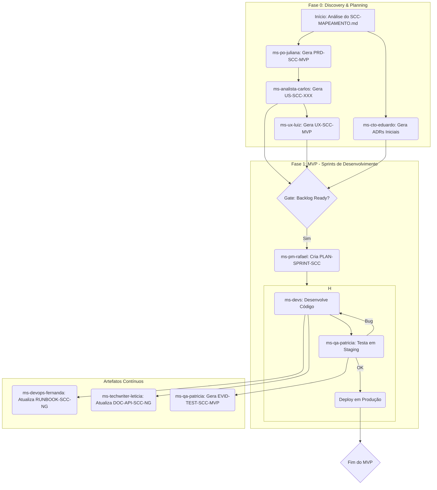

# Mapa da Missão (Versão Exaustiva): Reconstrução do Sistema de Controle de Contêineres (SCC)

**Autor**: ms-orquestrador (Manus AI)
**Data**: 02 de Março de 2026
**Versão**: 2.0 (Revisão Exaustiva)

---

## 1. Resumo Executivo

Este documento, o **Mapa da Missão**, é o plano diretor definitivo para a reconstrução completa do **Sistema de Controle de Contêineres (SCC)**. A análise de engenharia reversa do sistema legado (Visual FoxPro/SQL Server), documentada em `SCC-MAPEAMENTO.md`, revelou um ecossistema de alta complexidade, compreendendo **8 módulos**, **112 tabelas**, **336 formulários**, **48 relatórios**, e um emaranhado de regras de negócio críticas. A missão é realizar uma migração 1-para-1 de toda a funcionalidade para uma plataforma web moderna, robusta e escalável, orquestrada pelo time completo de 14 agentes da MULTISOFT. Este plano detalha, de forma exaustiva, o escopo, as fases, os artefatos, as responsabilidades, os gates de qualidade (DoR/DoD), os riscos, as dependências e o cronograma, servindo como a única fonte de verdade para todo o ciclo de vida do projeto.

## 2. Objetivo Estratégico

O objetivo primário é **substituir o sistema SCC legado por uma aplicação web moderna que replique 100% das funcionalidades existentes**, eliminando o débito técnico inerente à plataforma Visual FoxPro. O novo sistema, provisoriamente chamado de **SCC-NG (Next Generation)**, deve ser projetado sobre princípios de **segurança, escalabilidade, manutenibilidade e usabilidade**. Além da paridade funcional, o projeto visa a **centralização da lógica de negócio no backend**, a criação de **APIs RESTful** para futuras integrações, a implementação de uma **experiência de usuário (UX) intuitiva** e a garantia de **integridade e consistência dos dados** através de um processo de migração meticulosamente planejado.

## 3. Escopo de Reconstrução: Fases e Módulos

O projeto será executado em fases, priorizando o *core business* para garantir a continuidade operacional e mitigar riscos. O escopo foi definido com base na análise dos 8 módulos do sistema legado.

### Fase 1: MVP - O Fluxo de Valor Essencial

O MVP foca em colocar a operação mínima de pé: cadastros essenciais, o ciclo de venda/locação e o faturamento/recebimento inicial. A meta é validar a arquitetura e o fluxo principal em um ambiente de produção controlado.

| Módulo do MVP | Entidades de Dados (Tabelas) Envolvidas | Formulários Legados a Serem Reconstruídos (Exemplos) |
| :--- | :--- | :--- |
| **Cadastros (Core)** | `C_CLIENTES`, `C_PRODUTOS`, `C_MATERIAIS`, `C_VENDEDORES`, `C_TRANSPORTADORAS`, `C_SERVICOS`, `C_EMPRESAS`, `C_MUNICIPIOS` | `SCPCLIENTE`, `SCPPRODUTO`, `SCPMATERIAL`, `SCPVENDEDOR` |
| **Comercial** | `C_PROPOSTAS`, `C_PROPOSTASITENS`, `C_ACEITES`, `C_LISTANEGRA`, `C_ANALISECRITICA` | `SCPPROPOSTA`, `SCPAPROVAPROPOSTA`, `SCPACEITE`, `SCPANALISECRITICA` |
| **Locação** | `C_LOCACOES`, `C_IGPM` | `SCPLOCACAO`, `SCPREAJUSTE` (cálculo, sem tela) |
| **Faturamento** | `C_TITULOS`, `C_TITULOSITENS` | `SCPFATURAMENTO` (processo em lote) |
| **Financeiro (Core)** | `C_CONTACORRENTES`, `C_NUMEROBOLETO` | `SCPGERAREMESSA` (lógica de geração CNAB), `SCPBAIXAMANUAL` |
| **Segurança (Core)** | `C_USUARIOS`, `C_ACESSO` (simplificado) | `SCPUSUARIO`, `SCPTROCASENHA`, `SCPACesso` (lógica de verificação) |

### Fases Pós-MVP: Expansão Funcional

| Fase | Módulos e Funcionalidades Detalhadas |
| :--- | :--- |
| **Fase 2** | **Operacional Completo e Financeiro Avançado**: Implementação completa dos módulos de **Vistorias** (`C_VISTORIAS`), **Avarias** (`C_AVARIAS`, `C_AVARIAITENS`), **Reparos** (`C_REPAROS`), e **Controle de Estoque** (`SCPESTOQUE`). No Financeiro, desenvolver a **Baixa Automática via Retorno CNAB**, o **Cálculo de Comissões** (`C_COMISSOES`), e o controle de **Inadimplência** (`SCPINADIMPLENCIA`). |
| **Fase 3** | **Relatórios, Dashboards e Integrações**: Migração dos **48 relatórios** legados para um novo motor de relatórios/BI. Desenvolvimento de **dashboards gerenciais**. Implementação da **integração com o ERP TOTVS (RM/AX)** para sincronização de clientes e fornecedores. |
| **Fase 4** | **Utilitários e Permissões Granulares**: Reconstrução de todas as telas do módulo de **Utilitários**. Implementação do **sistema de permissões de 6 níveis** (`INC`, `ALT`, `EXC`, `EXE`, `CON`, `IMP`) por usuário e por tela, conforme a tabela `C_ACESSO` legada. |
| **Fase 5** | **Refinamento e Inovação**: Substituição da geração de documentos via OLE/Word por uma solução moderna baseada em templates (e.g., renderização de HTML/CSS para PDF). Introdução de novas funcionalidades, como um **portal do cliente** ou a aplicação de **modelos de IA** (sugestão do agente `ms-ia-sofia`). |

## 4. Inventário de Artefatos do Projeto

Cada fase gerará um conjunto de artefatos rastreáveis, seguindo o princípio MULTISOFT: "Se não está documentado, não existe."

| ID do Artefato | Nome do Artefato | Descrição | Responsável (Agente) |
| :--- | :--- | :--- | :--- |
| **PRD-SCC-MVP** | Product Requirements Document - MVP | Especificação funcional e não funcional exaustiva para o MVP. | `ms-po-juliana` |
| **US-SCC-XXX** | User Stories | Backlog detalhado com todas as histórias de usuário para o MVP, no formato Gherkin e atendendo ao DoR. | `ms-analista-carlos` |
| **UX-SCC-MVP** | UX/UI Specification - MVP | Wireframes, protótipos navegáveis e especificações de design para todas as telas do MVP. | `ms-ux-luiz` |
| **ADR-SCC-XXX** | Architecture Decision Records | Decisões de arquitetura (stack, padrões, infraestrutura) documentadas. | `ms-cto-eduardo` |
| **PLAN-IMPL-SCC-MVP** | Plano de Implementação - MVP | Detalhamento técnico das tarefas de desenvolvimento, incluindo modelo de dados e endpoints de API. | `ms-dev-renata`, `ms-dev-andre` |
| **SRC-SCC-NG** | Código-Fonte SCC-NG | Repositório Git contendo todo o código-fonte da aplicação, incluindo frontend, backend e testes. | `ms-dev-renata`, `ms-dev-andre` |
| **PLAN-TEST-SCC-MVP** | Plano de Testes - MVP | Estratégia e casos de teste para todas as funcionalidades do MVP. | `ms-qa-patricia` |
| **EVID-TEST-SCC-MVP** | Evidências de Teste - MVP | Screenshots, logs e relatórios que comprovam a execução e o resultado dos testes. | `ms-qa-patricia` |
| **RUNBOOK-SCC-NG** | Runbook de Operação | Procedimentos operacionais para deploy, monitoramento, backup e rollback da aplicação. | `ms-devops-fernanda` |
| **CHK-REL-SCC-MVP** | Checklist de Release Go/No-Go - MVP | Validação final de todos os critérios antes do deploy em produção. | `ms-qa-patricia` |
| **PLAN-SPRINT-SCC** | Sprint Plan | Planejamento das sprints de desenvolvimento, com alocação de tarefas e estimativas. | `ms-pm-rafael` |
| **DOC-API-SCC-NG** | Documentação da API | Documentação gerada automaticamente (e.g., Swagger/OpenAPI) para as APIs do sistema. | `ms-techwriter-leticia` |
| **PLAN-DATA-MIG** | Plano de Migração de Dados | Estratégia, scripts e plano de validação para a migração dos dados do SQL Server legado. | `ms-data-lucas` |

## 5. Matriz de Responsabilidades (RACI) por Agente

| Agente (Papel) | Tarefas Granulares no Projeto SCC |
| :--- | :--- |
| **Juliana (PO)** | **(R)** Definir e priorizar o backlog do produto. **(A)** Aprovar o PRD e as User Stories. **(C)** Comunicar a visão do produto para o time. **(I)** Ser informada sobre o progresso do desenvolvimento. |
| **Carlos (Analista)** | **(R)** Escrever User Stories detalhadas com critérios de aceite em Gherkin. **(A)** Validar se as stories atendem ao DoR. **(C)** Esclarecer dúvidas de negócio para o time de desenvolvimento. |
| **Luiz (UX)** | **(R)** Criar wireframes, protótipos e a especificação visual completa. **(A)** Aprovar a implementação da UI em staging. **(C)** Apresentar e validar os fluxos de usuário com stakeholders. |
| **Eduardo (CTO)** | **(R)** Definir a arquitetura e o stack tecnológico. **(A)** Aprovar ADRs e grandes refatorações. **(C)** Mentorear o time de desenvolvimento em questões técnicas complexas. |
| **Renata/André (Devs)** | **(R)** Implementar o código-fonte (frontend e backend) e os testes unitários/integração. **(A)** Realizar code reviews. **(C)** Participar do planejamento das sprints. |
| **Patrícia (QA)** | **(R)** Criar e executar o plano de testes. **(A)** Aprovar ou reprovar uma build (Go/No-Go). **(C)** Reportar bugs e validar as correções. |
| **Fernanda (DevOps)** | **(R)** Configurar e manter os pipelines de CI/CD e a infraestrutura. **(A)** Aprovar o plano de deploy e rollback. **(C)** Monitorar a saúde da aplicação em produção. |
| **Rafael (PM)** | **(R)** Gerenciar o cronograma, os riscos e a comunicação do projeto. **(A)** Facilitar as cerimônias ágeis (planning, daily, review, retro). **(C)** Ser o ponto de contato principal para os stakeholders. |
| **Bianca (Processos)** | **(R)** Mapear os processos de negócio legados em BPMN e propor otimizações. **(A)** Validar se o novo sistema adere aos processos definidos. |
| **Letícia (Tech Writer)** | **(R)** Escrever a documentação do usuário final e a documentação da API. **(A)** Garantir que a documentação esteja clara e atualizada a cada release. |
| **Sofia (IA)** | **(R)** Analisar os dados e processos para identificar oportunidades de automação e inteligência. **(C)** Propor modelos de ML/IA para fases futuras. |
| **Lucas (Data)** | **(R)** Projetar o novo esquema do banco de dados e executar a migração de dados. **(A)** Validar a integridade dos dados migrados. |

*(R)esponsible, (A)ccountable, (C)onsulted, (I)nformed*

## 6. Gates de Qualidade (DoR/DoD) Aplicados ao SCC

O avanço entre as etapas é condicionado à satisfação dos gates de qualidade, sem exceções.

- **Gate 1: PRD Aprovado (DoD do PO)**
  - **Critério**: O PRD-SCC-MVP deve conter o detalhamento de todos os módulos do MVP, regras de negócio mapeadas, e NFRs (Requisitos Não Funcionais) definidos.
  - **Bloqueia**: O início da criação das User Stories pelo `ms-analista-carlos`.

- **Gate 2: Backlog Pronto para Desenvolvimento (DoR dos Devs)**
  - **Critério**: 80% das User Stories do MVP devem estar no estado "Ready", com critérios de aceite em Gherkin, protótipos de UX anexados, e sem dependências bloqueadoras.
  - **Bloqueia**: O início da primeira sprint de desenvolvimento pelo `ms-dev-renata` e `ms-dev-andre`.

- **Gate 3: Feature Completa (DoD dos Devs)**
  - **Critério**: O código da feature deve estar mergeado na branch principal, com cobertura de testes unitários > 80%, code review aprovado, e build passando no CI.
  - **Bloqueia**: O início dos testes de aceitação pelo `ms-qa-patricia`.

- **Gate 4: Build Aprovada em Staging (DoD do QA)**
  - **Critério**: Todos os casos de teste da feature devem ter sido executados em staging, com 100% de aprovação nos testes críticos e sem bugs bloqueadores em aberto.
  - **Bloqueia**: A inclusão da feature no checklist de release para produção.

## 7. Riscos, Assunções, Dependências e Perguntas (RADP)

### Riscos Identificados

| ID | Risco | Probabilidade | Impacto | Plano de Mitigação | Responsável |
| :--- | :--- | :--- | :--- | :--- | :--- |
| **RISK-01** | **Lógica de Negócio Oculta**: A análise do código VFP é complexa e pode haver regras de negócio não documentadas, especialmente nos arquivos `.SCT` dos formulários. | **Alta** | **Alto** | Alocar uma fase de "Discovery Técnico" onde `ms-dev-andre` e `ms-analista-carlos` focam exclusivamente em dissecar a lógica dos formulários mais complexos (Faturamento, Reajuste, Comissões) antes de finalizar as User Stories. | `ms-cto-eduardo` |
| **RISK-02** | **Inconsistência na Migração de Dados**: Perda ou corrupção de dados durante a migração do SQL Server legado para o novo banco de dados. | **Média** | **Alto** | `ms-data-lucas` deve criar scripts de migração e de validação (checksum, contagem de registros). Executar múltiplos ciclos de teste de migração em um ambiente isolado. | `ms-data-lucas` |
| **RISK-03** | **Baixa Adoção pelo Usuário**: Os usuários, acostumados com o sistema legado por anos, podem resistir à nova interface e fluxos. | **Média** | **Média** | `ms-ux-luiz` deve conduzir sessões de validação de protótipo com usuários-chave da Multiteiner. `ms-techwriter-leticia` deve preparar material de treinamento e guias rápidos. | `ms-pm-rafael` |
| **RISK-04** | **"Scope Creep" (Aumento de Escopo)**: Solicitações de novas funcionalidades durante o desenvolvimento do MVP. | **Alta** | **Médio** | `ms-po-juliana` deve gerenciar o backlog de forma rigorosa, utilizando um processo formal de change request. Novas ideias são bem-vindas, mas devem ser adicionadas ao backlog das fases futuras. | `ms-po-juliana` |

### Assunções

- **A-01**: O time MULTISOFT completo (14 agentes) estará disponível durante todo o ciclo de vida do projeto.
- **A-02**: O acesso ao código-fonte legado, banco de dados e a um ambiente de teste do sistema antigo será garantido.
- **A-03**: Stakeholders da Multiteiner estarão disponíveis para sessões de esclarecimento e validação (pelo menos 4 horas por semana).

### Dependências Externas

- **D-01**: Acesso à documentação da API do ERP TOTVS para a Fase 3.
- **D-02**: Disponibilidade de uma pessoa de contato técnico na Multiteiner para esclarecer regras de negócio ambíguas.

### Perguntas em Aberto

- **Q-01 (Tecnologia)**: Qual a preferência de stack tecnológico para o novo sistema? (Ex: Backend: Java/Spring, .NET Core, Node.js; Frontend: React, Angular, Vue.js; DB: PostgreSQL, MySQL, SQL Server). A decisão será registrada em um ADR pelo `ms-cto-eduardo`.
- **Q-02 (Infraestrutura)**: A implantação será em nuvem (AWS, Azure, GCP) ou on-premise? Se for em nuvem, já existe uma conta e infraestrutura base configurada?
- **Q-03 (Dados Históricos)**: Qual a política de retenção de dados? Todos os 10+ anos de dados legados precisam ser migrados e estar acessíveis online no novo sistema, ou podemos arquivar dados mais antigos?
- **Q-04 (Autenticação)**: O sistema deve se integrar com algum provedor de identidade corporativo (ex: Azure AD, Google Workspace) para Single Sign-On (SSO)?

## 8. Estrutura da Execução: Orquestração e Fluxo de Trabalho

O projeto será executado em uma sequência lógica, onde a saída de um agente se torna a entrada para o próximo, garantindo rastreabilidade e qualidade em cada etapa.

## 9. Cronograma Detalhado por Fase e Sprint (Estimativa Exaustiva)

Esta estimativa detalha o esforço por fase, sprint e agente, fornecendo uma visão granular do cronograma. Cada sprint tem a duração de 2 semanas.

### Fase 0: Discovery & Planning (4 Semanas / 2 Sprints)

**Objetivo**: Produzir todos os artefatos de planejamento (PRD, User Stories, UX, ADRs) para que o desenvolvimento do MVP possa começar com máxima clareza e mínimo risco.

| Sprint | Agente(s) | Foco Principal e Entregáveis |
| :--- | :--- | :--- |
| **Sprint 0** | Juliana (PO), Carlos (Analista), Luiz (UX), Eduardo (CTO) | **Kick-off e Alinhamento**. Análise profunda do `SCC-MAPEAMENTO.md`. Entrevistas com stakeholders. Esboço inicial do PRD. Definição de NFRs. Esboço da arquitetura e ADRs preliminares (Stack, DB). |
| **Sprint 1** | Juliana (PO), Carlos (Analista), Luiz (UX), Eduardo (CTO) | **Finalização dos Artefatos de Planejamento**. PRD-SCC-MVP finalizado e aprovado. 80% das User Stories do MVP escritas e refinadas. Protótipo de alta fidelidade do fluxo principal (Proposta -> Locação) validado. ADRs de arquitetura finalizados. **GATE 1 e 2 CONCLUÍDOS**. |

### Fase 1: MVP - Desenvolvimento (20 Semanas / 10 Sprints)

**Objetivo**: Desenvolver, testar e implantar o MVP, cobrindo o fluxo de valor essencial do SCC.

| Sprints | Agente(s) Foco | Módulos/Features a Serem Desenvolvidos |
| :--- | :--- | :--- |
| **Sprints 2-3** | Devs, QA, DevOps | **Setup e Core de Cadastros**: Estrutura do projeto, pipeline CI/CD, autenticação. CRUDs de Clientes, Produtos, Materiais. |
| **Sprints 4-5** | Devs, QA | **Módulo Comercial**: Criação e listagem de Propostas. Adição de itens. Validação de Lista Negra e Inadimplência. |
| **Sprints 6-7** | Devs, QA | **Fluxo de Aprovação e Locação**: Aprovação gerencial de propostas. Geração do Aceite. Criação do contrato de Locação. Atualização de status do contêiner. |
| **Sprints 8-9** | Devs, QA | **Core do Faturamento e Financeiro**: Processo em lote para gerar Títulos a partir de Locações. Cálculo de *pro rata*. Geração de boletos e lógica do arquivo de remessa CNAB. |
| **Sprint 10** | Devs, QA | **Baixa Manual e Relatórios Iniciais**: Implementação da tela de baixa manual de títulos. Relatórios simples (Clientes, Locações Ativas). |
| **Sprint 11** | Todos | **End-to-End Testing e Hardening**: Testes de integração completos, correção de bugs, preparação para o deploy. **GATE 3 e 4 CONCLUÍDOS**. Deploy em produção. |

### Fases Pós-MVP (Estimativa de Alto Nível)

| Fase | Duração Estimada (Sprints) | Foco Principal |
| :--- | :--- | :--- |
| **Fase 2: Operacional/Financeiro Avançado** | 6-8 Sprints (12-16 semanas) | Vistorias, Avarias, Reparos, Estoque, Retorno CNAB, Comissões. |
| **Fase 3: Relatórios e Integrações** | 4-5 Sprints (8-10 semanas) | Migração dos 48 relatórios, Dashboards de BI, Integração ERP TOTVS. |
| **Fase 4: Utilitários e Permissões** | 3-4 Sprints (6-8 semanas) | Telas de utilitários, sistema de permissão granular completo. |

**Duração Total Estimada (Fases 0-4):** 25 - 29 Sprints (50 - 58 semanas).

## 10. Próximos Passos Imediatos

1.  **Aprovação Formal do Mapa da Missão**: O cliente (Vinicius) deve revisar este documento e dar o "go" formal para o início do projeto.
2.  **Agendamento da Reunião de Kick-off**: `ms-pm-rafael` irá agendar a reunião de início com todos os 14 agentes e os stakeholders chave da Multiteiner para a próxima semana.
3.  **Setup do Ambiente de Projeto**: `ms-devops-fernanda` irá provisionar os repositórios Git, o board do projeto (e.g., Jira/Azure DevOps) e os canais de comunicação (e.g., Slack/Teams).
4.  **Coleta de Acessos**: `ms-pm-rafael` irá coordenar a obtenção de todos os acessos necessários ao ambiente legado (código-fonte, banco de dados) para o time de Discovery.

---

*Este Mapa da Missão é um documento vivo e será atualizado pelo `ms-pm-rafael` ao final de cada fase para refletir o progresso, as mudanças e os novos aprendizados.*
